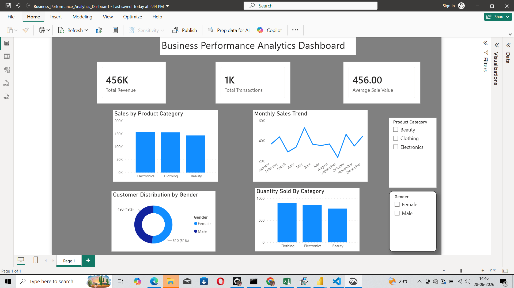

# SQL Business-Performance-Analysis-using PostgreSQL and PowerBI
## 📌 Project Overview
This project analyzes retail sales data using PostgreSQL and visualizes business insights using Power BI.

## 🛠️ Tools Used
- PostgreSQL
- SQL
- Power BI
- VS Code

## 📂 Dataset
- 1000 Retail Sales Records
- Customer Demographics
- Product Categories
- Sales Transactions

## 📊 Dashboard Features
- Total Revenue
- Total Transactions
- Average Sale
- Sales by Product Category
- Monthly Sales Trend
- Customer Distribution by Gender
- Quantity Sold by Category
- Interactive Slicers

## 📝 SQL Operations
- Database Creation
- Table Creation
- Data Import using COPY
- Data Analysis Queries
- Aggregate Functions
- GROUP BY
- ORDER BY

## 📁 Project Files
- Business_Performance_Analytics_Dashboard.pbix
- retail_sales_queries.sql
- retail_sales_dataset.csv

## 👩‍💻 Author
Ratcheni
## dashboard Preview

